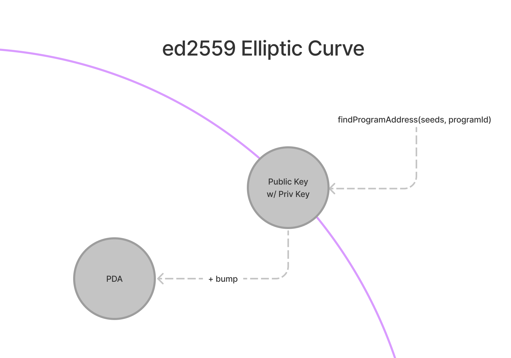

# Program Derived Addresses (PDAs) (Programdan Türetilmiş Adresler)

Program Derived Addresses (Programdan Türetilmiş Adresler, PDA’lar), belirli bir program tarafından kontrol edilmek üzere tasarlanmış account'lara ev sahipliği yapar. PDA'lar ile programlar, private key’e ihtiyaç duymadan belirli adresleri programlı olarak imzalayabilir. PDA'lar, Solana uygulamalarının birbirleriyle birleştirilebilir olmasını sağlayan [Cross-Program Invocation](https://docs.solana.com/developing/programming-model/calling-between-programs#cross-program-invocations)’ın(programlar arası çağırma) temeli olarak hizmet eder.

## Facts (Özet Bilgiler)

**Bilgi Tablosu**
- PDA'lar, public key’lere benzeyen ancak karşılık gelen private key’e sahip olmayan 32 byte’lık array’lerdir.
- `findProgramAddress`, bir programId ve seed’lerden (bayt koleksiyonu) deterministik olarak bir PDA türetecektir.
- Potansiyel bir PDA'yı ed25519 eliptik eğriden çıkarmak için bir bump (bir bayt) kullanılır.
- Programlar, seed’ler [invoke_signed](https://docs.solana.com/developing/programming-model/calling-between-programs#program-signed-accounts) ile kendi PDA'ları için imzalama yapabilir.
- Bir PDA yalnızca türetildiği program tarafından imzalanabilir.
- Programların farklı talimatları imzalamasına izin vermenin yanı sıra, PDA'lar ayrıca [Account'ları indekslemek](../guides/account-maps.md) için hashmap benzeri bir arayüz sağlar.

## Deep Dive (Derinlemesine Bakış)

PDA'lar, Solana'da programlar geliştirmek için temel bir yapı taşıdır. PDA'lar sayesinde programlar, hiçbir harici kullanıcının aynı Account için geçerli bir imza oluşturamayacağını garanti ederken Account’ları imzalayabilir. Hesapları imzalamaya ek olarak, belirli programlar kendi PDA'larında tutulan account'ları da değiştirebilir.

<small style="text-align:center;display:block;">Image courtesy of <a href="https://twitter.com/pencilflip">Pencilflip</a></small>

### Generating PDAs (PDA’lar Oluşturma)

PDA'ların arkasındaki kavramı anlamak için, PDA'ların teknik olarak yaratılmadığını, daha çok bulunduğunu düşünmek faydalı olabilir. PDA'lar, seed (`"vote_account"` string’i gibi) ve bir program kimliği kombinasyonundan oluşturulur. Bu seed ve program kimliği kombinasyonu daha sonra, ed25519 eliptik eğri üzerinde yer alan bir public key oluşturup oluşturmadıklarını görmek için bir sha256 hash fonksiyonu aracılığıyla çalıştırılır.

Program kimliğimizi ve seed’leri bir hash fonksiyonu aracılığıyla çalıştırırken, eliptik eğri üzerinde yer alan geçerli bir public key ile karşılaşma şansımız ~%50'dir. Bu durumda, girdimizi biraz geçiştirmek için bir şeyler ekleriz ve tekrar deneriz. Bu fudge faktör için teknik terim bump’tır. Solana'da, bump = 255 ile başlıyoruz ve eliptik eğride olmayan bir adres elde edene kadar, bump = 254, bump = 253, vb. ile aşağı doğru yineliyoruz. Bu ilkel görünebilir, ancak bir kez bulunduğunda bize aynı PDA'yı tekrar tekrar türetmenin deterministik bir yolunu sunar.

### Interacting with PDAs (PDA’lar ile Etkileşim)

Bir PDA oluşturulduğunda, `findProgramAddress` hem adresi hem de adresi eliptik eğriden çıkarmak için kullanılan bump’ı döndürür. Bu bump ile donanmış bir program, daha sonra PDA'sını gerektiren herhangi bir talimat için imzalayabilir. İmzalamak için, programların talimatı, account listesini ve PDA'yı `invoke_signed` olarak türetmek için kullanılan seed ve bump’ı geçmesi gerekir. Talimatları imzalamaya ek olarak, PDA'lar `invoke_signed` aracılığıyla kendi yaratımları için de imzalamalıdır.

PDA'larla oluştururken, bump seed account verilerinin kendisinde saklamak yaygındır. Bu, geliştiricilerin, bir talimat argümanı olarak bump’tan geçmek zorunda kalmadan bir PDA'yı kolayca doğrulamasını sağlar.

## Other Resources (Diğer Kaynaklar)
- [Official Documentation](https://docs.solana.com/developing/programming-model/calling-between-programs#program-derived-addresses)
- [Understanding Program Derived Addresses](https://www.brianfriel.xyz/understanding-program-derived-addresses/)
