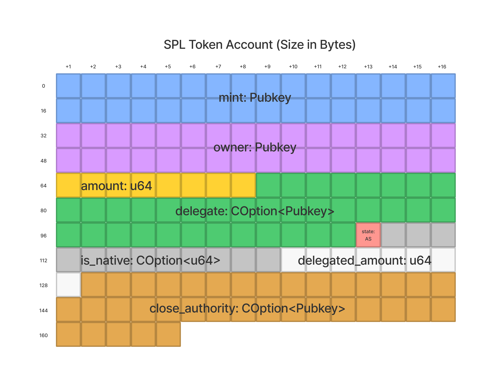

# 獲取程序帳戶

一個返回程序所擁有的賬戶的RPC方法。目前不支持分頁。請求`getProgramAccounts`應該包括`dataSlice`和/或`filters`參數，以提高響應時間並返回只有預期結果的內容。

## 綜述

::: tip 參數

- `programId`: `string` - 要查詢的程序的公鑰，以base58編碼的字符串形式提供。
- (可選) `configOrCommitment`: `object` - 包含以下可選字段的配置參數：
    - (可選) `commitment`: `string` - [狀態承諾/State commitment](https://docs.solana.com/developing/clients/jsonrpc-api#configuring-state-commitment)
    - (可選) `encoding`: `string` - 賬戶數據的編碼方式，可以是： `base58`, `base64`, 或 `jsonParsed`. 請注意 web3js 用戶應改用 [getParsedProgramAccounts](https://solana-labs.github.io/solana-web3.js/classes/Connection.html#getParsedProgramAccounts)
    - (可選) `dataSlice`: `object` - 根據以下內容限制返回的賬戶數據：
        - `offset`: `number` - 開始返回賬戶數據的字節數
        - `length`: `number` - 要返回的賬戶數據的字節數
    - (可選) `filters`: `array` - 使用以下過濾器對象對結果進行過濾：
        - `memcmp`: `object` - 將一系列字節與賬戶數據匹配：
            - `offset`: `number` - 開始比較的賬戶數據字節偏移量
            - `bytes`: `string` - 要匹配的數據，以base58編碼的字符串形式，限制爲129個字節
        - `dataSize`: `number` - 將賬戶數據的長度與提供的數據大小進行比較
    - (可選) `withContext`: `boolean` - 將結果包裝在一個 [RpcResponse JSON object](https://docs.solana.com/developing/clients/jsonrpc-api#rpcresponse-structure)
	
##### 響應

默認情況下，`getProgramAccounts`將返回一個具有以下結構的 JSON 對象數組：

- `pubkey`: `string` - 賬戶公鑰，以 base58 編碼的字符串形式
- `account`: `object` - 一個包含以下子字段的 JSON 對象：
    - `lamports`: `number`, 分配給賬戶的 lamports 數量
    - `owner`: `string`, 賬戶所分配的程序的 base58 編碼的公鑰
    - `data`: `string` | `object` - 與賬戶關聯的數據，根據提供的編碼參數，可以是編碼的二進制數據或 JSON 格式 parameter
    - `executable`: `boolean`, 指示賬戶是否包含着程序
    - `rentEpoch`: `number`, 該賬戶下次需要支付租金的紀元（epoch）
:::

## 深入

`getProgramAccounts` 是一個多功能的RPC方法，用於返回由程序擁有的所有賬戶。我們可以利用`getProgramAccounts`進行許多有用的查詢，例如查找：

- 特定錢包的所有代幣賬戶
- 特定代幣發行的所有代幣賬戶（即所有[SRM](https://www.projectOpenBook.com/)持有人)
- 特定程序的所有自定義賬戶（即所有[Mango](https://mango.markets/)用戶)

儘管`getProgramAccounts`非常有用，但由於目前的限制，它經常被誤解。許多由`getProgramAccounts`支持的查詢需要RPC節點掃描大量數據。這些掃描需要大量的內存和資源。因此，調用過於頻繁或範圍過大可能導致連接超時。此外，在撰寫本文時，`getProgramAccounts`端點不支持分頁。如果查詢結果太大，響應將被截斷。

爲了解決當前的限制，`getProgramAccounts`提供了一些有用的參數，包括`dataSlice`和`filters`選項的`memcmp`和`dataSize`。通過提供這些參數的組合，我們可以將查詢範圍縮小到可管理和可預測的大小。

`getProgramAccounts`的一個常見示例涉及與[SPL-Token Program](https://spl.solana.com/token) 程序交互。僅使用基本調用請求由Token程序擁有的所有賬戶將涉及大量的數據。然而，通過提供參數，我們可以高效地請求我們要使用的數據。

### `filters`
與`getProgramAccounts`一起使用的最常見參數是`filters`數組。該數組接受兩種類型的過濾器，即`dataSize`和`memcmp`。在使用這些過濾器之前，我們應該熟悉我們請求的數據的佈局和序列化方式。

#### `dataSize`
在Token程序的情況下，我們可以看到[代幣賬戶的長度爲165個字節](https://github.com/solana-labs/solana-program-library/blob/08d9999f997a8bf38719679be9d572f119d0d960/token/program/src/state.rs#L86-L106)。 具體而言，一個代幣賬戶有八個不同的字段，每個字段需要一定數量的字節。我們可以使用下面的示例圖來可視化這些數據的佈局。

如果我們想找到由我們的錢包地址擁有的所有代幣賬戶，我們可以在`filters`數組中添加`{ dataSize: 165 }`來將查詢範圍縮小爲僅限長度爲165個字節的賬戶。然而，僅此還不夠。我們還需要添加一個過濾器來查找由我們的地址擁有的賬戶。我們可以使用`memcmp`過濾器實現這一點。

#### `memcmp`
`memcmp`過濾器，也叫"內存比較"過濾器，允許我們比較存儲在賬戶上的任何字段的數據。具體而言，我們可以查詢僅與特定位置上的特定一組字節匹配的賬戶。`memcmp`需要兩個參數：

- `offset`: 開始比較數據的位置。這個位置以字節爲單位，表示爲一個整數。
- `bytes`: 數據應該與賬戶的數據匹配。這表示爲一個base58編碼的字符串，應該限制在129個字節以下。

需要注意的是，`memcmp`只會返回與提供的`bytes`完全匹配的結果。目前，它不支持與提供的`bytes`相比小於或大於的比較。

繼續使用我們的Token程序示例，我們可以修改查詢，只返回由我們的錢包地址擁有的代幣賬戶。觀察代幣賬戶時，我們可以看到存儲在代幣賬戶上的前兩個字段都是公鑰，而且每個公鑰的長度爲32個字節。鑑於`owner`是第二個字段，我們應該從`offset`爲32字節的位置開始進行`memcmp`。從這裏開始，我們將尋找owner字段與我們的錢包地址匹配的賬戶。

我們可以通過以下實例來調用此查詢：

<CodeGroup>
  <CodeGroupItem title="TS" active>

@[code](@/code/get-program-accounts/memcmp/memcmp.en.ts)

  </CodeGroupItem>

  <CodeGroupItem title="Rust Client" active>

@[code](@/code/get-program-accounts/memcmp/memcmp.en.rs)

  </CodeGroupItem>

  <CodeGroupItem title="cURL" active>

@[code](@/code/get-program-accounts/memcmp/memcmp.en.sh)

  </CodeGroupItem>
</CodeGroup>

### `dataSlice`

除了上面提到的兩個過濾器參數以外，`getProgramAccounts`的第三個最常見參數是`dataSlice`。與`filters`參數不同，`dataSlice`不會減少查詢返回的賬戶數量。`dataSlice`將限制的是每個賬戶的數據量。

與`memcmp`類似，`dataSlice`接受兩個參數：

- `offset`: 開始返回賬戶數據的位置（以字節爲單位）
- `length`: 應該返回的字節數

在處理大型數據集但實際上不關心賬戶數據本身時，`dataSlice`特別有用。例如，如果我們想找到特定代幣發行的代幣賬戶數量（即代幣持有者數量），就可以使用`dataSlice`。

<CodeGroup>
  <CodeGroupItem title="TS" active>

@[code](@/code/get-program-accounts/dataSlice/dataSlice.en.ts)

  </CodeGroupItem>

  <CodeGroupItem title="Rust Client" active>

@[code](@/code/get-program-accounts/dataSlice/dataSlice.en.rs)

  </CodeGroupItem>

  <CodeGroupItem title="cURL" active>

@[code](@/code/get-program-accounts/dataSlice/dataSlice.en.sh)

  </CodeGroupItem>
</CodeGroup>

通過組合這三個參數（`dataSlice`、`dataSize`和`memcmp`），我們可以限制查詢的範圍，並高效地返回我們想要的數據。

## 其他資料

- [RPC API Documentation](https://docs.solana.com/developing/clients/jsonrpc-api#getprogramaccounts)
- [Web3js Documentation](https://solana-labs.github.io/solana-web3.js/classes/Connection.html#getProgramAccounts)
- [JSON-parsed Web3js Documentation](https://solana-labs.github.io/solana-web3.js/classes/Connection.html#getParsedProgramAccounts)
